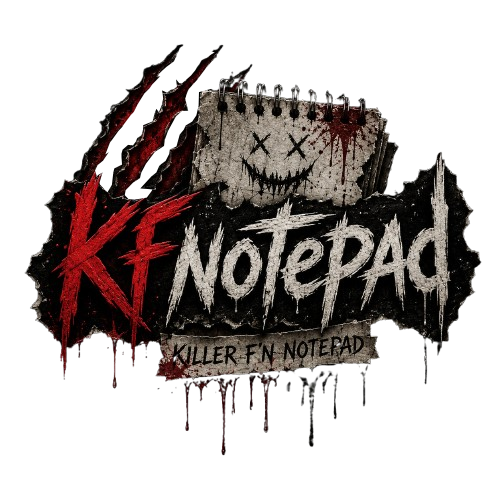

<p align="center">
  
</p>

# kfnotepad

Local UTF-8 text-file editor with a modern terminal UI and a separate Iced desktop GUI.

## Status

kfnotepad is a local-only UTF-8 text editor with a terminal UI and a separate Iced GUI. The current public
contracts, security notes, and operations runbook are in `docs/`.

Safety defaults include regular UTF-8 file handling, symlink/non-regular file rejection, atomic saves, and
file-browser deletion through the operating system Trash/Recycle Bin after explicit confirmation.

## Start here

```bash
./scripts/doctor.sh
./scripts/check.sh
./scripts/run.sh --help
```

Current editor launch:

```bash
./scripts/run.sh path/to/note.txt
```

In an interactive terminal this opens the editor. In non-interactive contexts it prints a read-only summary.
See [`docs/16-CLI-CONTRACT.md`](docs/16-CLI-CONTRACT.md) for keybindings and current behavior.

Current GUI launch:

```bash
cargo run --locked --no-default-features --features "gui syntax" --release --bin kfnotepad-gui -- path/to/note.txt
```

The GUI opens local files as tiled documents and uses the same file validation/save adapter as the terminal editor.
See [`docs/17-GUI-CONTRACT.md`](docs/17-GUI-CONTRACT.md) for GUI controls, persistence, current gaps, and smoke steps.

Local release artifact:

```bash
./scripts/package.sh
```

This writes a tarball, Linux `.deb`, AppImage, and SHA-256 files under ignored `dist/` with both `kfnotepad` and
`kfnotepad-gui`. Packaging and verification notes are in [`docs/13-OPERATIONS.md`](docs/13-OPERATIONS.md).

Version tags matching `vX.Y.Z` run the native GitHub release workflow. Releases include Linux packages, standalone
Windows TUI/GUI `.exe` files plus a combined ZIP, and an ad-hoc-signed, non-notarized macOS `.dmg` containing
`kfnotepad.app` and the terminal binary. Published artifacts are covered by a consolidated `SHA256SUMS` file. Manual
workflow dispatches default to a non-publishing package dry-run.

## Selected direction

- Type: cli plus separate GUI binary
- Stage: cross-platform alpha with separate TUI and Iced GUI packages for tagged releases
- Stack: rust, shell, iced
- Database: none; normal files on disk
- Support tiers:
  - Supported: Linux (primary; CI + local packaging documented).
  - Windows/macOS: native builds and tests run in CI; Windows packages are unsigned, while macOS packages are
    ad-hoc signed but not notarized.
- License: AGPL-3.0-or-later

### Build features

The crate supports feature gates for leaner builds:

- `tui` (default): terminal editor dependencies
- `gui`: Iced GUI dependencies for the separate GUI binary
- `syntax` (default): shared Syntect highlighting implementation; it can be omitted from either front end for a
  smaller plain-text build

Default features are `["tui", "syntax"]`. GUI is intentionally excluded from defaults so terminal-only users can build without Iced/rfd.
Release packages enable syntax highlighting for both binaries.

Core-only tools and benchmarks can exclude both front ends and syntax with `--no-default-features`.

Default builds are terminal-capable. For an explicit minimal TUI-only build in constrained environments, run:

```bash
cargo build --locked --no-default-features --features tui
cargo run --locked --no-default-features --features tui --bin kfnotepad -- --help
cargo build --locked --no-default-features --features "tui syntax"
```

To build a lean plain-text GUI or the normal syntax-enabled GUI explicitly:

```bash
cargo build --locked --no-default-features --features gui
cargo build --locked --no-default-features --features "gui syntax"
cargo run --locked --no-default-features --features "gui syntax" --release --bin kfnotepad-gui -- --describe
```

External file changes are detected by a long-lived, debounced native watcher. Watcher events are revalidated through
the conservative snapshot adapter; metadata-first polling remains the fallback when watching is unavailable.

## Documentation

See [`docs/README.md`](docs/README.md) for the public documentation map.
Release highlights and upgrade notes are recorded in [`CHANGELOG.md`](CHANGELOG.md).

## Storage and paths

Editor config, notes, and layout/workspace persistence use platform config/data directories resolved through the `dirs` crate:

- Config and UI layout/preferences: platform config directory + `kfnotepad/`.
- Managed notes: platform data directory + `kfnotepad/notes`.
- Workspace snapshots: platform config directory + `kfnotepad/workspaces/...`.

The behavior is intentionally deterministic and preserves prior `XDG` layout on Unix when present while allowing
non-Unix platforms to follow their native directories.
